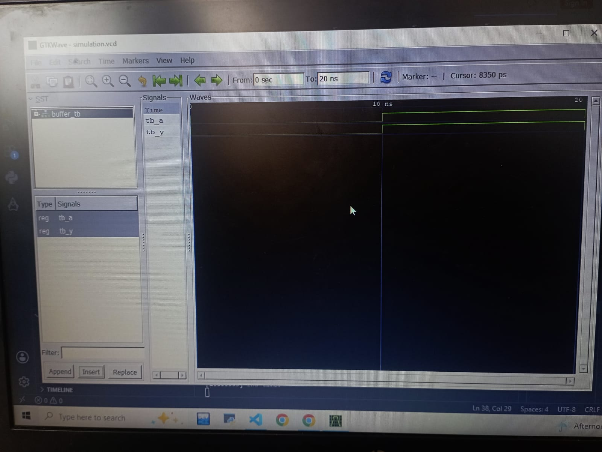

# Lab 1: Introduction to VHDL Programming and Open-Source Simulation Environment

# Objective
The objectives of this laboratory are:

- To understand the basics of VHDL (VHSIC Hardware Description Language).
- To learn the structure of a VHDL program.
- To install and configure the open-source VHDL simulator GHDL.
- To install GTKWave for viewing simulation waveforms.
- To compile, simulate, and analyze simple VHDL programs.
- To understand the complete VHDL design flow from coding to simulation.

---

# Introduction

VHDL (Very High-Speed Integrated Circuit Hardware Description Language) is a hardware description language used for designing, modeling, simulating, and synthesizing digital systems.

Unlike programming languages such as C or Python, VHDL describes hardware behavior and circuit structure. Engineers use VHDL for FPGA and ASIC development.

The typical VHDL design flow consists of:

1. Writing the VHDL source code.
2. Compiling the code.
3. Elaborating the design.
4. Running simulation.
5. Viewing waveforms.
6. Synthesizing the design (for hardware implementation).

This laboratory introduces the complete workflow using open-source tools

# Expected Truth Table

| A | B | Y |
|---|---|---|
| 0 | 0 | 0 |
| 0 | 1 | 0 |
| 1 | 0 | 0 |
| 1 | 1 | 1 |

---
#output

# Conclusion

This laboratory introduced the fundamentals of VHDL programming and familiarized students with the open-source simulation environment using GHDL and GTKWave. Students learned the complete VHDL design workflow, including writing VHDL code, compiling, elaborating, simulating, and viewing waveforms. This practical knowledge forms the foundation for designing and testing more complex digital circuits in subsequent laboratory sessions.

---

