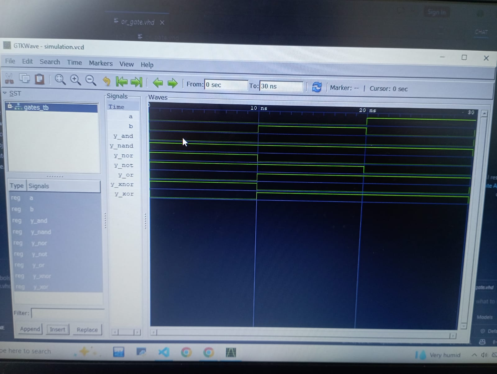

# Lab 2: VHDL Code for Realizing Logic Gates

## Computer Architecture (CMP 262)

---

# Objective

The objectives of this laboratory are:

- To understand the operation of basic digital logic gates.
- To implement the fundamental logic gates using VHDL.
- To compile and simulate VHDL designs using GHDL.
- To verify the functionality of each logic gate through simulation.
- To observe the generated waveforms using GTKWave.
- To compare the simulation results with the expected truth tables.

---

# Introduction

Logic gates are the fundamental building blocks of digital systems. Every digital circuit, from simple combinational circuits to complex processors, is constructed using combinations of these gates.

VHDL (VHSIC Hardware Description Language) allows designers to describe digital hardware using a programming-like syntax. It provides a reliable way to model, simulate, and verify digital circuits before hardware implementation.

In this laboratory, the seven basic logic gates—AND, OR, NOT, NAND, NOR, XOR, and XNOR—were implemented individually using VHDL. A single testbench was then used to verify the functionality of all gates simultaneously by applying every possible combination of two binary inputs.

---

# Theory

Digital logic gates perform Boolean operations on one or more binary inputs to produce a binary output.

The logic gates implemented in this experiment are:

| Logic Gate | Description |
|------------|-------------|
| **AND** | Produces HIGH only when both inputs are HIGH. |
| **OR** | Produces HIGH when at least one input is HIGH. |
| **NOT** | Produces the complement (inverse) of the input. |
| **NAND** | Produces the inverse of the AND operation. |
| **NOR** | Produces the inverse of the OR operation. |
| **XOR** | Produces HIGH when the inputs are different. |
| **XNOR** | Produces HIGH when both inputs are the same. |

# Expected Truth Table

| A | B | AND | OR | NOT A | NAND | NOR | XOR | XNOR |
|:-:|:-:|:--:|:--:|:-----:|:----:|:---:|:---:|:----:|
| 0 | 0 | 0 | 0 | 1 | 1 | 1 | 0 | 1 |
| 0 | 1 | 0 | 1 | 1 | 1 | 0 | 1 | 0 |
| 1 | 0 | 0 | 1 | 0 | 1 | 0 | 1 | 0 |
| 1 | 1 | 1 | 1 | 0 | 0 | 0 | 0 | 1 |

---

# Observations

- All logic gates produced outputs according to their Boolean expressions.
- The simulation waveform confirmed correct operation for every input combination.
- The NOT gate responded only to input **A**, while the remaining gates responded to both **A** and **B**.
- The waveform generated in GTKWave matched the expected truth table.

---

# Results

- Successfully implemented all seven basic logic gates using VHDL.
- Successfully compiled the design using GHDL.
- Successfully simulated the circuit without errors.
- Successfully verified the outputs using GTKWave.

#output:

# Conclusion

This laboratory demonstrated the implementation and verification of the seven fundamental logic gates using VHDL. Individual gate modules were created and tested collectively using a single testbench. Simulation results matched the expected truth table for all input combinations, confirming the correctness of the VHDL implementations. The experiment also provided practical experience with GHDL for simulation and GTKWave for waveform analysis, strengthening the understanding of digital logic design and hardware description languages.

