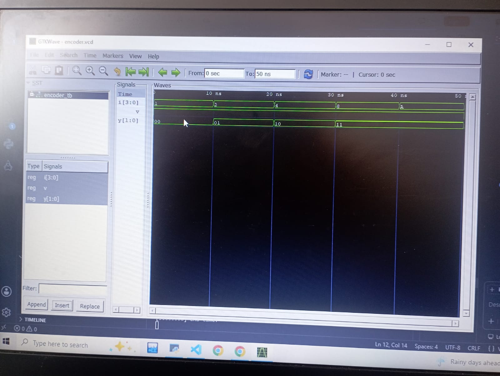
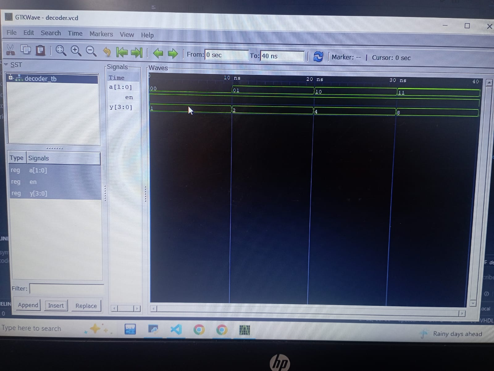

# Lab 3: VHDL Code for Combinational Circuits (Encoder and Decoder)

## Computer Architecture (CMP 262)

---

# Objective

The objectives of this laboratory are:

- Design and implement a **4-to-2 Priority Encoder** using VHDL.
- Design and implement a **2-to-4 Decoder** using VHDL.
- Understand the operation of combinational logic circuits.
- Verify the functionality of the encoder and decoder using simulation.
- Analyze the simulation waveforms generated by GHDL and GTKWave.

---

# Introduction

Combinational circuits are digital logic circuits whose outputs depend only on the current values of their inputs. Unlike sequential circuits, they do not require memory elements or clock signals.

Among the most widely used combinational circuits are **encoders** and **decoders**. These circuits are essential components in digital systems, communication devices, processors, memory addressing, and control units.

In this experiment, a **4-to-2 Priority Encoder** and a **2-to-4 Decoder** were designed using the VHDL hardware description language. Their functionality was verified through simulation using the GHDL simulator and waveform visualization using GTKWave.

---

# Theory

## Combinational Circuits

A combinational circuit is a logic circuit in which the output is determined solely by the present input values. There are no feedback paths or storage elements involved.

Characteristics include:

- No memory elements.
- Output changes immediately when inputs change.
- Implemented using logic gates.
- Used in arithmetic units, multiplexers, decoders, encoders, comparators, and many other digital systems.

---

# 4-to-2 Priority Encoder

## Overview

An encoder converts multiple input lines into a smaller number of output bits. A **4-to-2 encoder** converts four input lines into a two-bit binary output.

A **priority encoder** assigns priority to the highest-order input when more than one input is active simultaneously. This removes ambiguity that occurs in a standard encoder.

For this design:

- Inputs: I0, I1, I2, I3
- Outputs: Y1, Y0
- Valid Output: V

The **Valid (V)** signal indicates whether at least one input is active.

---

## Working Principle

The encoder continuously monitors all four inputs.

- If **I3** is HIGH, it has the highest priority and the output becomes **11**.
- Otherwise, if **I2** is HIGH, the output becomes **10**.
- Otherwise, if **I1** is HIGH, the output becomes **01**.
- Otherwise, if **I0** is HIGH, the output becomes **00**.
- If no input is active, the Valid signal becomes LOW and the output defaults to **00**.

---

## Priority Order

Highest Priority → Lowest Priority

```
I3
↓
I2
↓
I1
↓
I0
```

---

## Truth Table

| I3 | I2 | I1 | I0 | Y1 | Y0 | V |
|----|----|----|----|----|----|---|
|0|0|0|1|0|0|1|
|0|0|1|X|0|1|1|
|0|1|X|X|1|0|1|
|1|X|X|X|1|1|1|
|0|0|0|0|0|0|0|

---

## Applications of Priority Encoder

- Interrupt handling in processors
- Keyboard encoding
- Data compression
- Priority arbitration
- Communication systems

---

# 2-to-4 Decoder

## Overview

A decoder converts binary information into one of several output lines. A **2-to-4 decoder** accepts a 2-bit binary input and activates exactly one of four outputs.

This decoder also includes an **Enable (EN)** input. The decoder operates only when EN is HIGH.

---

## Working Principle

The decoder checks the Enable signal first.

- When **EN = 1**, one output corresponding to the binary input becomes HIGH.
- When **EN = 0**, all outputs remain LOW regardless of the input.

Only one output remains active at any given time.

---

## Truth Table

| EN | A1 | A0 | Y3 | Y2 | Y1 | Y0 |
|----|----|----|----|----|----|----|
|1|0|0|0|0|0|1|
|1|0|1|0|0|1|0|
|1|1|0|0|1|0|0|
|1|1|1|1|0|0|0|
|0|X|X|0|0|0|0|


# Expected Simulation Results

## Priority Encoder

The simulation should demonstrate:

- Correct binary output for each active input.
- Highest priority assigned to I3.
- Valid signal becomes LOW when all inputs are inactive.
- Proper operation even when multiple inputs are HIGH simultaneously.

---

## Decoder

The simulation should demonstrate:

- Exactly one output HIGH when Enable is active.
- Output corresponds correctly to the binary input.
- All outputs remain LOW when Enable is disabled.
- Correct one-hot output generation.

---

# Observations

During the simulation:

- The priority encoder correctly selected the highest-priority active input.
- The Valid signal accurately indicated whether any input was active.
- The decoder successfully activated only one output line at a time.
- The Enable input correctly controlled the decoder operation.
- All observed outputs matched the theoretical truth tables.

---

# Advantages

## Priority Encoder

- Eliminates ambiguity when multiple inputs are active.
- Efficient binary encoding.
- Widely used in interrupt systems.
- Reduces the number of output lines.

## Decoder

- Simple hardware implementation.
- One-hot output generation.
- Essential for memory and address selection.
- Easy to expand for larger decoding applications.


#output:



# Conclusion

This laboratory successfully demonstrated the design and simulation of a **4-to-2 Priority Encoder** and a **2-to-4 Decoder** using VHDL. The simulation results verified that both circuits operated according to their respective truth tables. The priority encoder correctly selected the highest-priority active input, while the decoder accurately activated only the corresponding output line when enabled. The experiment provided practical experience in VHDL modeling, combinational circuit design, testbench development, and waveform verification using GHDL and GTKWave.
