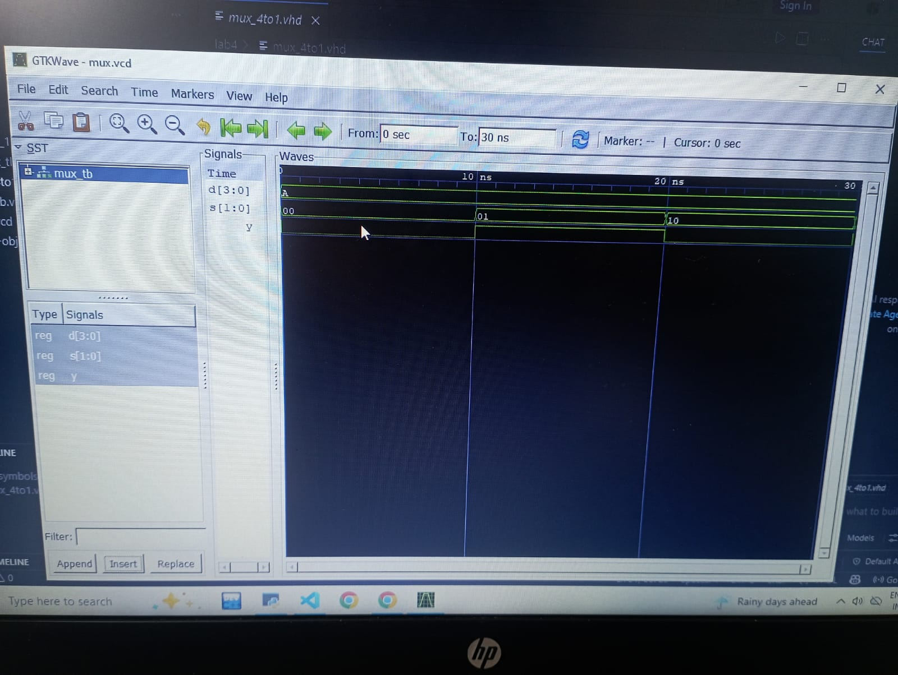
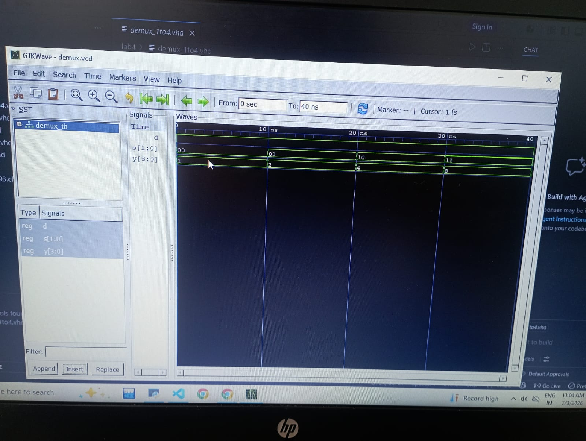

# Lab 4: VHDL Code for Combinational Circuits (MUX and DEMUX)

## Computer Architecture (CMP 262)

---

# Objective

The objectives of this laboratory are:

- To understand the working principle of a 4-to-1 Multiplexer (MUX).
- To understand the working principle of a 1-to-4 Demultiplexer (DEMUX).
- To implement combinational circuits using VHDL.
- To compile, simulate, and verify VHDL designs using GHDL.
- To analyze simulation waveforms using GTKWave.

---

# Introduction

A multiplexer (MUX) and a demultiplexer (DEMUX) are important combinational logic circuits widely used in digital systems. A multiplexer selects one input from several available inputs and forwards it to a single output. Conversely, a demultiplexer takes one input and routes it to one of several outputs based on the selection lines.

These circuits are extensively used in communication systems, processors, memory addressing, data routing, and digital control applications. This laboratory demonstrates the implementation and verification of both circuits using the VHDL hardware description language.

---

# Theory

## Multiplexer (MUX)

A Multiplexer (MUX), also called a **data selector**, is a combinational circuit that selects one input from multiple input lines and transfers it to a single output.

For a **4-to-1 Multiplexer**:

- Number of data inputs: 4
- Number of select lines: 2
- Number of outputs: 1

The select lines determine which input is connected to the output.

### Truth Table

| S1 | S0 | Output (Y) |
|----|----|------------|
| 0 | 0 | D0 |
| 0 | 1 | D1 |
| 1 | 0 | D2 |
| 1 | 1 | D3 |

## Demultiplexer (DEMUX)

A Demultiplexer (DEMUX), also called a **data distributor**, is a combinational circuit that routes one input signal to one of many outputs.

For a **1-to-4 DEMUX**:

- Number of inputs: 1
- Number of select lines: 2
- Number of outputs: 4

Only one output becomes active according to the select lines.

### Truth Table

| S1 | S0 | Active Output |
|----|----|---------------|
| 0 | 0 | Y0 = D |
| 0 | 1 | Y1 = D |
| 1 | 0 | Y2 = D |
| 1 | 1 | Y3 = D |

# Expected Results

## 4-to-1 Multiplexer

The output should match the selected input.

| Select (S1S0) | Selected Input | Output |
|---------------|----------------|--------|
| 00 | D0 | D0 |
| 01 | D1 | D1 |
| 10 | D2 | D2 |
| 11 | D3 | D3 |

---

## 1-to-4 Demultiplexer

The selected output should receive the input while all other outputs remain LOW.

| Select (S1S0) | Active Output |
|---------------|---------------|
| 00 | Y0 |
| 01 | Y1 |
| 10 | Y2 |
| 11 | Y3 |

# Advantages

## Multiplexer

- Reduces hardware complexity.
- Efficient data routing.
- Simplifies circuit design.
- Saves wiring and components.

## Demultiplexer

- Simple data distribution.
- Efficient signal routing.
- Useful for memory and communication systems.
- Reduces hardware requirements.

#output:

# Conclusion

This laboratory successfully demonstrated the design and simulation of a 4-to-1 Multiplexer and a 1-to-4 Demultiplexer using VHDL. The simulation results confirmed that the multiplexer correctly selected one of the four input signals based on the select lines, while the demultiplexer successfully routed the input signal to the appropriate output. The generated waveforms matched the expected truth tables, verifying the correctness of the designs. This experiment strengthened the understanding of combinational logic circuits, VHDL modeling, simulation, and waveform analysis using GHDL and GTKWave.

